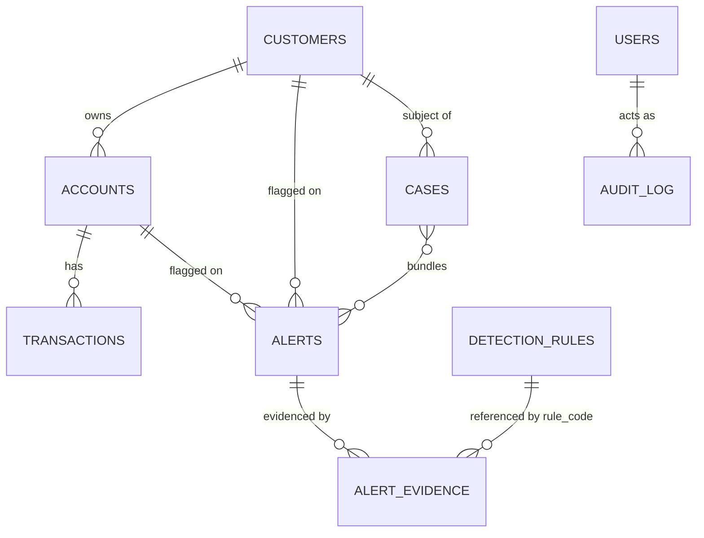
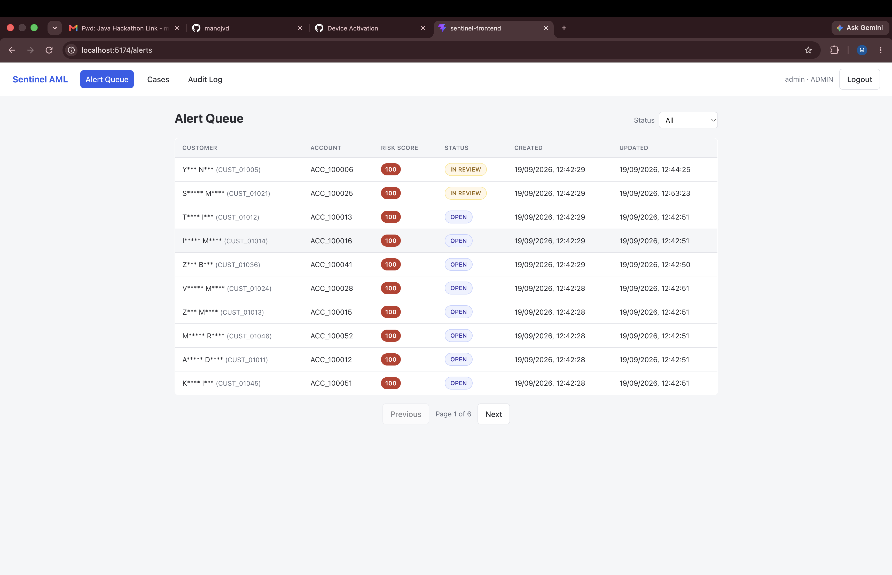
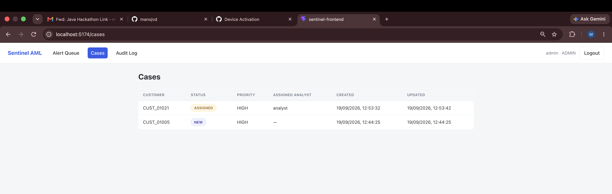
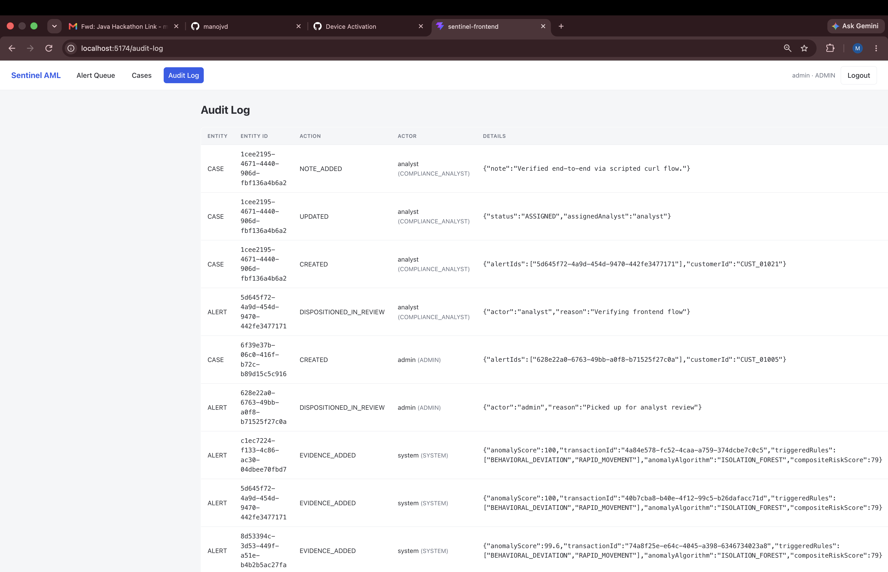

# Sentinel AML

Real-time money laundering detection platform: ingests customer, account, and
transaction data, applies rule-based and ML-based anomaly detection, and surfaces
risk-scored alerts for compliance analysts to work through case management.

Built for the "Sentinel AML" hackathon brief in `BlrAzenioJavahackathon/`.

## Stack

- **Backend**: Spring Boot 4.1.1, Java 17, Maven, Spring Data JPA, Spring Security (JWT),
  Flyway, PostgreSQL driver, springdoc-openapi, commons-csv, Smile (ML), JUnit 5 + Mockito
- **Frontend**: React (Vite)
- **Database**: PostgreSQL (local Docker container)

## Architecture

Layered, package-by-feature under `com.sentinel.aml`:

| Package | Responsibility |
|---|---|
| `domain` / `repository` | JPA entities and Spring Data repositories |
| `security` | JWT issuance/validation, Spring Security config, RBAC, demo users |
| `ingestion` | CSV bulk load (customers/accounts/transactions) and the single-transaction streaming endpoint |
| `detection` | The rule engine: `DetectionRule` implementations, `RuleConfigService` (DB-backed, hot-reloadable config), `DetectionEngine` orchestration, currency/jurisdiction lookups |
| `anomaly` | ML anomaly scoring (Isolation Forest / K-Means via Smile) that runs alongside the rule engine and blends into the final risk score (see below) |
| `alert` | Alert queue, evidence/explanation detail, disposition workflow |
| `casemgmt` | Case creation, assignment, status, notes |
| `admin` | Runtime-editable config: detection rule thresholds/weights, high-risk jurisdiction list, exchange rates; plus the read-only audit log |
| `common` | Cross-cutting: global error handling, audit logging, PII masking, OpenAPI config |
| `seed` | One-shot synthetic demo dataset covering every typology |

### Detection flow

1. A transaction lands via `POST /api/v1/transactions` (single, evaluated synchronously,
   sub-second) or the bulk CSV path (`POST /api/v1/ingest/transactions`, which inserts the whole
   batch first, then fans detection out across a bounded thread pool -- see "Performance" below).
2. `DetectionEngine` runs every **enabled** `DetectionRule` against the transaction. Each rule
   reads its own thresholds from the `detection_rules` table (cached with a short TTL) so
   thresholds/weights/enabled-flags can be tuned live via the admin API, no redeploy needed.
3. In parallel, `FeatureExtractionService` builds a feature vector and
   `AnomalyScoringService` (Isolation Forest by default, K-Means as a swappable alternative --
   `sentinel.anomaly.algorithm`) scores it for statistical anomalousness.
4. `RiskScoreCombiner` blends the two signals into one 0-100 score with a plain-English
   rationale: a strong ML outlier with no rule match still surfaces (novel pattern, no name for
   it yet); a rule match on transaction that looks routine for that customer gets dampened
   (false-positive reduction); otherwise a rules-weighted blend.
5. If the composite score is > 0, `AlertPersistenceService` finds-or-creates the customer's one
   open alert (dedup key = customer id) and appends an `AlertEvidence` row per contributing
   rule/the anomaly model -- this is the alert de-duplication/aggregation mechanism: a customer
   never gets 50 redundant alerts for the same underlying pattern, and the risk score only
   ratchets up within an alert's lifetime rather than dropping because a later event was milder.
   A partial unique index (`ux_alerts_open_dedup`) plus a per-customer lock make this safe under
   concurrent transaction streams.
6. Analysts disposition alerts (`START_REVIEW` / `CLEAR` / `ESCALATE`, reason required) and can
   bundle one or more of a customer's alerts into a `Case`. Nothing is ever deleted -- disposition
   just changes status and is written to the immutable `audit_log`.

### Schema / ERD

Managed by Flyway migrations in `sentinel-backend/src/main/resources/db/migration/`
(`V1__init_schema.sql` is the authoritative source; `V2`/`V3` seed reference data).



Reference/config tables editable at runtime via the admin API: `exchange_rates` (currency ->
base-currency rate, base = INR), `high_risk_jurisdictions` (the sanctions/high-risk country
list), `detection_rules` (enabled flag, weight, JSON threshold config per rule).

### Security & compliance

- Stateless JWT auth (`POST /api/v1/auth/login`), roles `ADMIN` / `COMPLIANCE_ANALYST` /
  `VIEWER`, enforced with `@PreAuthorize` at the controller layer -- not just hidden in the UI.
- PII masking (customer name, ID numbers) happens in the **service layer**
  (`CustomerQueryService`, `AlertService`): list views are always masked; detail views are
  unmasked only for `ADMIN`/`COMPLIANCE_ANALYST`.
- All alert/case state transitions, rule-config edits, and jurisdiction/rate changes are written
  to the insert-only `audit_log` (actor, role, timestamp, JSON detail) -- no repository
  update/delete methods exist for that table.
- No secrets are hardcoded. `JWT_SECRET`, `DB_URL`, `DB_USERNAME`, `DB_PASSWORD`, and the three
  demo users' passwords are all environment-variable overridable (see `application.yml` for the
  local-dev defaults, which are for this sandboxed demo only).

### Performance

Bulk transaction ingestion inserts the whole CSV batch first, then evaluates detection for every
row in parallel across a configurable thread pool (`sentinel.detection.thread-pool-size`,
default 8) -- correct because window-based rules query by `txn_timestamp`, not insertion order,
so it doesn't matter that the whole batch is already committed before any row gets evaluated.
The demo seed endpoint (below) loads and detects 10,000 transactions in well under a minute on a
local dev machine, comfortably inside the "10k transactions in <2 min" target.

## Prerequisites

- JDK 17 or 21
- Node.js & npm
- PostgreSQL reachable at `localhost:5432` (this repo assumes a `root`/`root` user, matching a
  default local Docker Postgres setup)

> **Sandboxed/agent dev environments only**: if `mvn`/`java` fail to reach Maven Central with
> `SocketException: Network is unreachable` even though `curl` works fine, the environment is
> IPv6-only and Java's default address selection tries IPv4 first. Pass
> `-Djava.net.preferIPv6Addresses=true` via `MAVEN_OPTS` (build) and as a JVM arg (run). Not
> needed on a normal machine.

## Database

Create the database once:

```sh
psql -h localhost -U root -c "CREATE DATABASE sentinel_aml"
```

Flyway creates/validates the schema automatically on startup.

## Backend

```sh
cd sentinel-backend
./mvnw spring-boot:run
```

Runs on http://localhost:8090. OpenAPI/Swagger UI at http://localhost:8090/swagger-ui.html
(raw spec at `/v3/api-docs`).

Run the unit tests (rule engine + anomaly scoring, no DB needed for those):

```sh
./mvnw test
```

## Frontend

```sh
cd sentinel-frontend
npm install
npm run dev -- --port 5174
```

Talks to the backend at http://localhost:8090 (CORS is configured for `localhost:5174`).

## Rule configuration approach

Every AML typology is a `DetectionRule` Spring bean, but its thresholds/weights/enabled-flag
live in the `detection_rules` table, not in code -- so compliance can retune without a
redeploy:

```sh
# list current rules and thresholds
curl -H "Authorization: Bearer $TOKEN" http://localhost:8090/api/v1/admin/rules

# tighten the structuring window, or disable a rule entirely
curl -X PUT http://localhost:8090/api/v1/admin/rules/STRUCTURING \
  -H "Authorization: Bearer $TOKEN" -H "Content-Type: application/json" \
  -d '{"weight": 50, "config": {"minAmountBase": 8500, "maxAmountBase": 9999, "windowHours": 24, "minCount": 3}}'
```

Changes take effect within one short cache TTL (`sentinel.detection.rule-config-cache-ttl-seconds`,
default 30s) with no restart. The high-risk jurisdiction list and exchange rate table are
similarly editable via `/api/v1/admin/high-risk-jurisdictions` and `/api/v1/admin/exchange-rates`.

## Demo walkthrough

Demo users (seeded automatically on first startup): `admin`/`Admin@12345`,
`analyst`/`Analyst@12345`, `viewer`/`Viewer@12345`.

```sh
# 1. Log in
TOKEN=$(curl -s -X POST http://localhost:8090/api/v1/auth/login \
  -H 'Content-Type: application/json' -d '{"username":"admin","password":"Admin@12345"}' \
  | python3 -c "import sys,json;print(json.load(sys.stdin)['token'])")

# 2. Seed the full demo dataset: the given sample customers/accounts, ~50 more synthetic ones,
#    and ~10,000 transactions -- including a deliberate sequence for every typology
#    (CTR threshold, structuring, rapid movement, high-risk jurisdiction, round-number,
#    behavioral deviation) plus benign noise. Reports elapsed time.
curl -X POST "http://localhost:8090/api/v1/admin/seed-demo-data?totalTransactions=10000" \
  -H "Authorization: Bearer $TOKEN"

# 3. Ingestion -> detection already happened as part of seeding. See the alert queue,
#    sorted by risk score:
curl -H "Authorization: Bearer $TOKEN" "http://localhost:8090/api/v1/alerts?size=5"

# 4. Open one alert's evidence/explanation (pick an id from step 3):
curl -H "Authorization: Bearer $TOKEN" http://localhost:8090/api/v1/alerts/<id>

# 5. Disposition it (never deletes -- status change + audit trail):
curl -X POST http://localhost:8090/api/v1/alerts/<id>/disposition \
  -H "Authorization: Bearer $TOKEN" -H "Content-Type: application/json" \
  -d '{"action":"START_REVIEW","reason":"Picked up for analyst review"}'

# 6. Bundle it into a case:
curl -X POST http://localhost:8090/api/v1/cases \
  -H "Authorization: Bearer $TOKEN" -H "Content-Type: application/json" \
  -d '{"customerId":"<from step 4>","alertIds":["<id>"],"priority":"HIGH","summary":"Initial triage"}'

# 7. Confirm the immutable audit trail:
curl -H "Authorization: Bearer $TOKEN" "http://localhost:8090/api/v1/audit-log?size=5"
```

Or drive the same flow from the React dashboard (login -> alert queue -> alert detail ->
disposition -> case) once `npm run dev` is up.

### A note on demo data volume

The synthetic customers get relatively thin transaction histories (a mix of sparse and denser
activity across a 60-day noise window), so `BEHAVIORAL_DEVIATION`'s 90-day rolling average is
easy to trip for many of them -- expect a fairly high alert count from the seed run (most
seeded customers, not just the six deliberately-crafted typology accounts). That's a
characteristic of the synthetic data's thin baselines, not a detection bug; each alert still
carries a specific, correct rule explanation and evidence transaction IDs.

## Screenshots

| Alert queue | Case detail | Audit log |
|---|---|---|
|  |  |  |

## Demo video

<video src="screenshots/demo.mp4" controls width="720"></video>

(If the inline player doesn't render, [download/view the video directly](screenshots/demo.mp4).)
